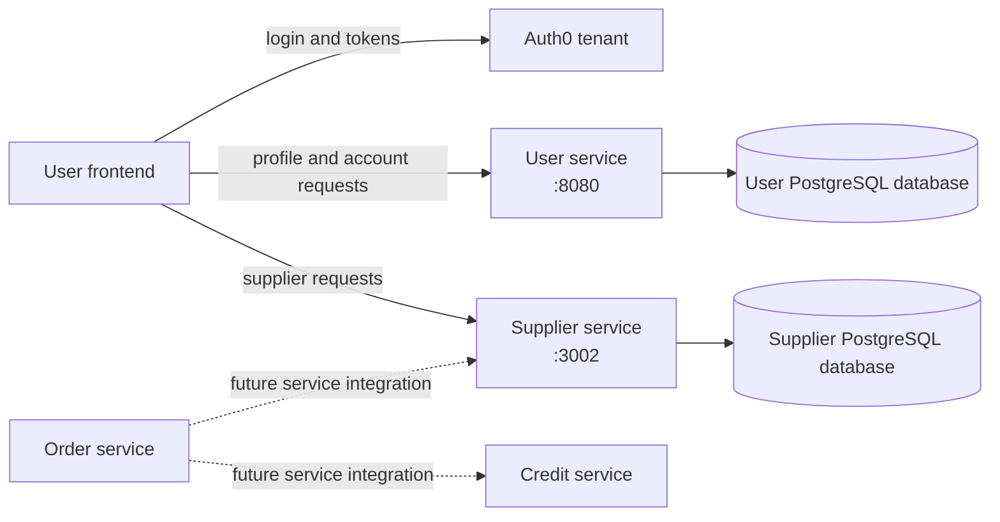
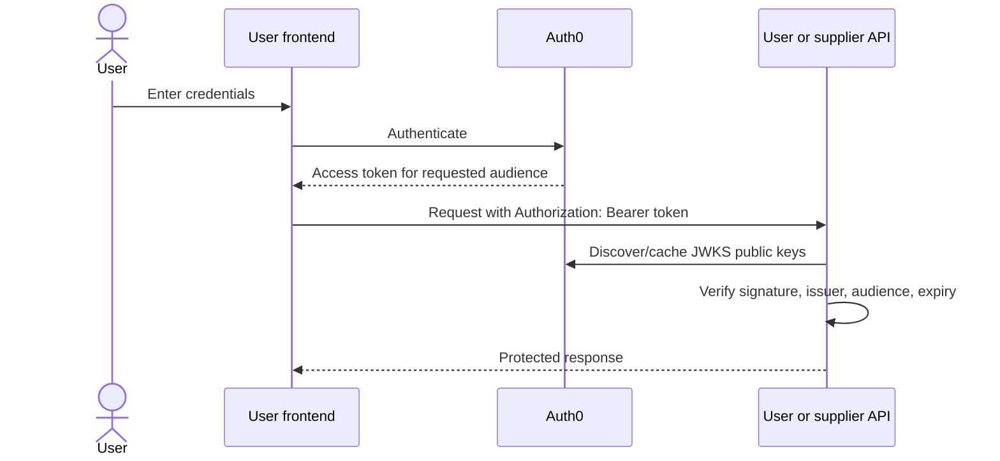
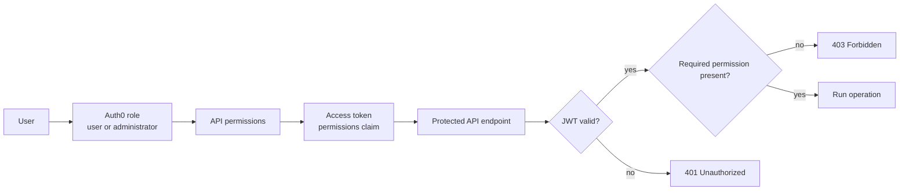
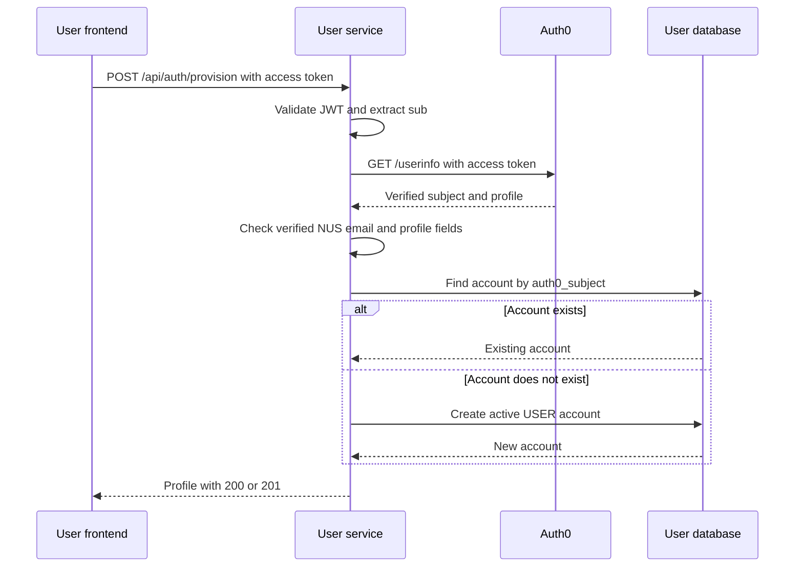
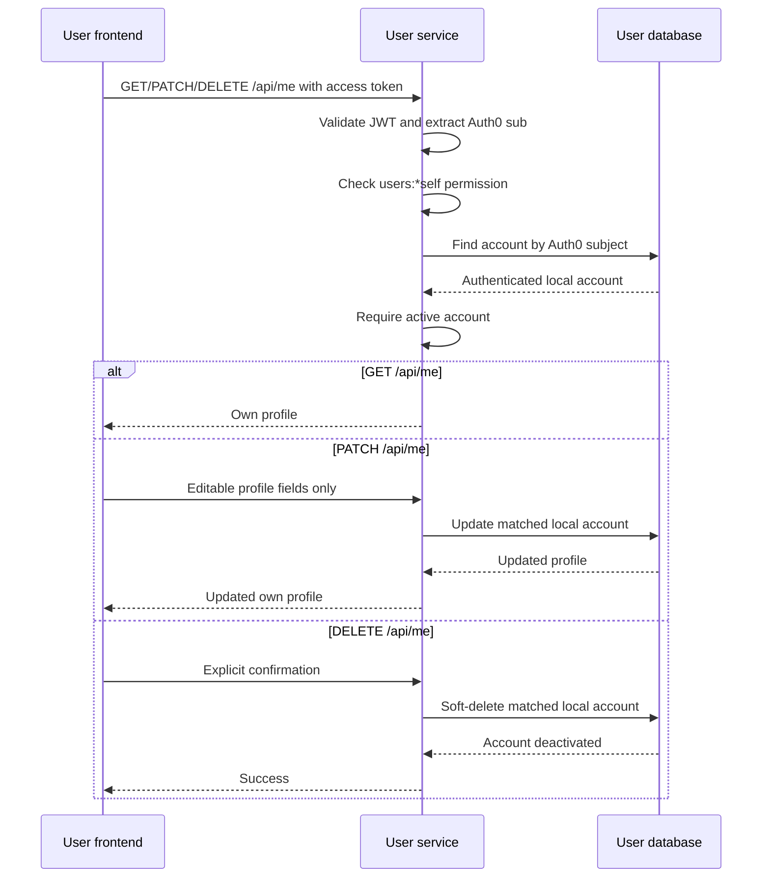
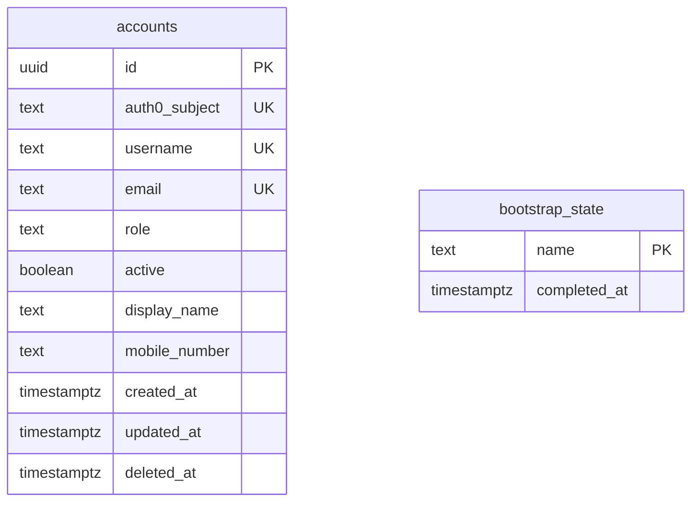

# User-service architecture

These diagrams describe the current user-service implementation. Auth0 owns
credentials and sessions; user-service owns local accounts, profiles, roles,
and account state.

## 1. System architecture

Each service owns its own database. Services coordinate through APIs or events,
not by querying another service's database directly.

## 2. Auth0 login and access-token flow

The API verifies the JWT locally. The token is not decrypted, and the Auth0
private signing key is never shared with the services.

## 3. RBAC authorization flow

The current administrator role receives the broad user-management permissions.
Local `ADMIN` and `SUPER_ADMIN` accounts have the same API functionality for
now; the local distinction remains available for future policy changes.

## 4. User provisioning sequence

Provisioning never links an existing account by email. The Auth0 subject is the
authoritative external identity key.

## 5. Self-service account flow

The client never supplies the target account ID. The account is selected from
the validated Auth0 `sub`, so `/api/me` can only operate on the caller's own
local account.

## 6. Database schema

`accounts.auth0_subject`, `username`, and `email` are unique. Soft-deleted
accounts remain in the database and continue reserving their identities.
`bootstrap_state` is a singleton coordination row used to make initial
super-administrator creation safe across concurrent service starts. It has no
foreign-key relationship to `accounts`.

The migrations under [`../migrations`](../migrations/) are the database source
of truth; this diagram is documentation only.
